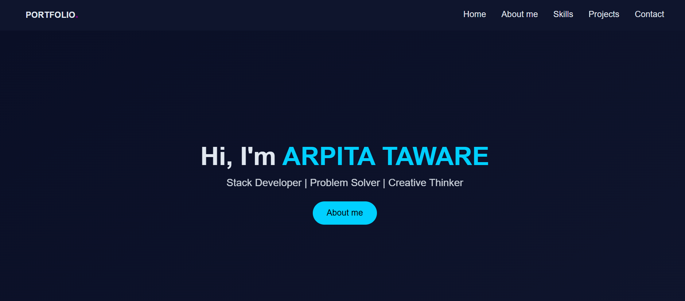
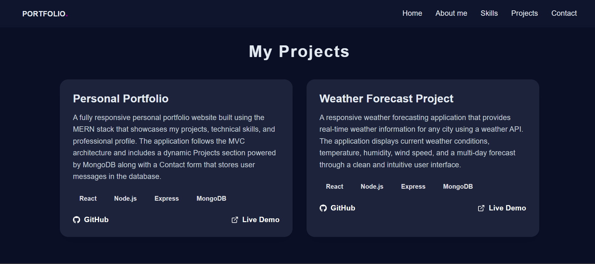
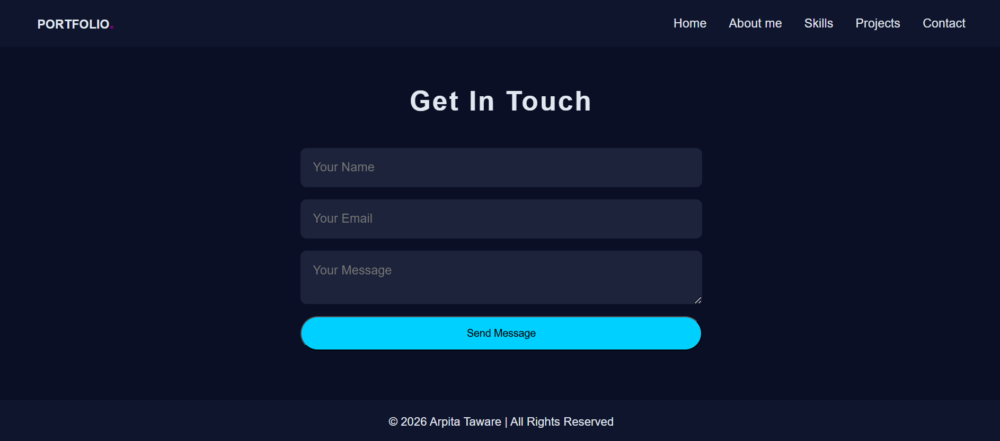

# 🌐 Personal Portfolio Website

A modern, full-stack **Personal Portfolio Website** built with the **MERN Stack (MongoDB, Express.js, React.js, Node.js)**. The website showcases my projects, technical skills, and provides a contact form that securely stores visitor messages in MongoDB Atlas.

## 🚀 Live Demo

* 🌍 **Portfolio:** https://arpitataware.vercel.app/
* ⚙️ **Backend API:** https://portfolio-backend-dcw4.onrender.com

---

## ✨ Features

* 🎨 Modern and responsive user interface
* 👋 Hero and About Me sections
* 🛠️ Technical Skills section
* 📂 Dynamic Projects section powered by MongoDB
* 📬 Contact form with backend integration
* ☁️ Cloud-hosted backend using Render
* 🚀 Frontend deployed on Vercel
* 📱 Responsive design for desktop, tablet, and mobile devices
* 🔒 Environment variable configuration for secure deployment

---

## 🛠️ Tech Stack

### Frontend

* React.js
* HTML5
* CSS3
* JavaScript (ES6+)
* Axios

### Backend

* Node.js
* Express.js

### Database

* MongoDB Atlas
* Mongoose

### Deployment

* Vercel
* Render

### Version Control

* Git
* GitHub

---

## 📁 Project Structure

```text
personal-portfolio/
│
├── frontend/
│   ├── public/
│   ├── src/
│   │   ├── components/
│   │   ├── App.js
│   │   └── styles.css
│   ├── package.json
│   └── .env
│
├── backend/
│   ├── controllers/
│   ├── models/
│   ├── routes/
│   ├── app.js
│   ├── server.js
│   ├── package.json
│   └── .env
│
├── .gitignore
└── README.md
```

---

## ⚙️ Getting Started

### Clone the repository

```bash
git clone https://github.com/Arpita-Taware/personal-portfolio.git
```

### Navigate to the project

```bash
cd personal-portfolio
```

### Install frontend dependencies

```bash
cd frontend
npm install
```

### Install backend dependencies

```bash
cd ../backend
npm install
```

---

## 🔑 Environment Variables

### Backend (`backend/.env`)

```env
MONGO_URI=your_mongodb_connection_string
PORT=5000
```

### Frontend (`frontend/.env`)

```env
REACT_APP_API_URL=http://localhost:5000
```

---

## ▶️ Running the Application

### Start Backend

```bash
cd backend
npm run dev
```

### Start Frontend

```bash
cd frontend
npm start
```

Frontend:

```text
http://localhost:3000
```

Backend:

```text
http://localhost:5000
```

---

## 📸 Screenshots

### Home Page



### Projects Section



### Contact Section



---

## 🔮 Future Improvements

* 🌙 Dark / Light mode
* 🎞️ Smooth animations with Framer Motion
* 📄 Resume download
* 📊 Skill progress animations
* 📝 Blog section
* 📈 Visitor analytics
* 🔍 SEO optimization
* 🛡️ Admin dashboard for project management
* 📧 Email notifications for contact form submissions

---

## 👩‍💻 Author

**Arpita Taware**
